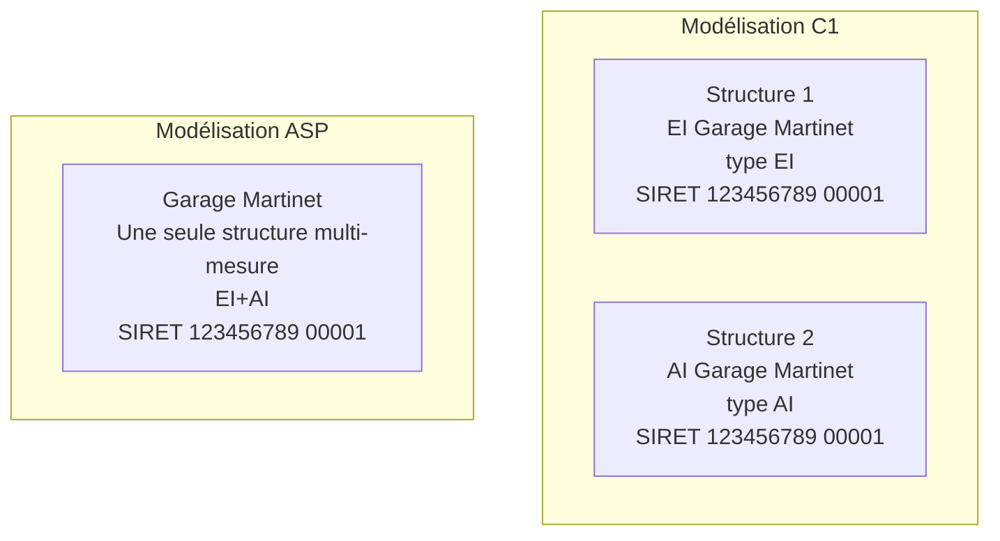
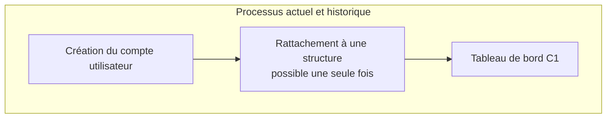
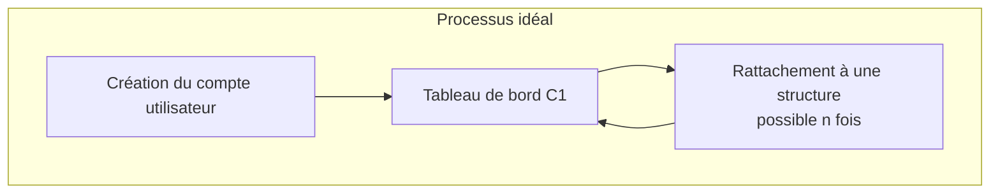
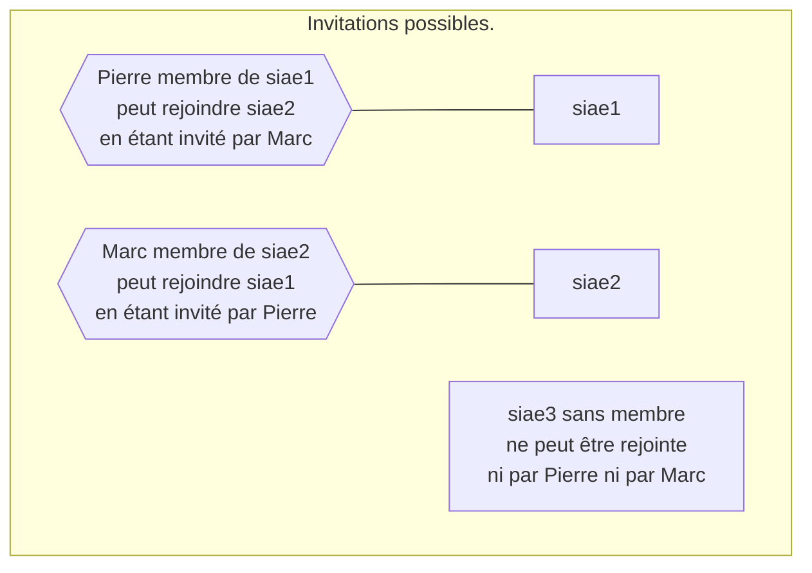
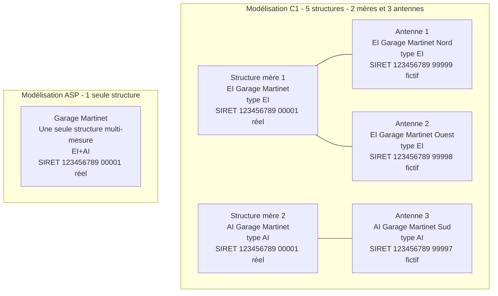
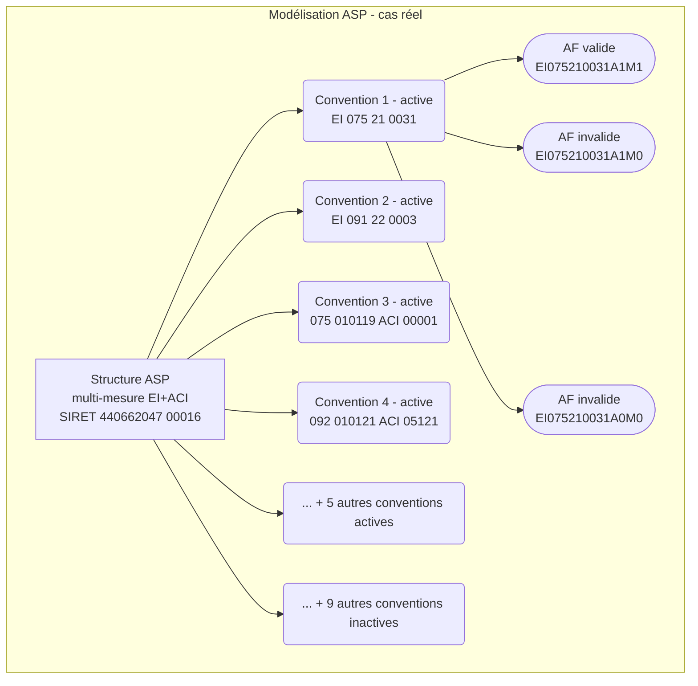

# Histoire de la modélisation des structures

## Vocabulaire préalable

- C1 signifie Chantier 1 - Les emplois de l'inclusion.
- Les *types* de structure côté C1 (ACI, AI...) sont appelés *mesures* côté ASP.
- Toute SIAE est une structure mais toute structure n'est pas une SIAE. Les SIAE sont de type AI, ACI, EI, ETTI ou EITI et d'autres types de structures non SIAE existent : GEIQ, EA, EATT.
- Une structure "non inscrite" signifie qu'elle existe dans les données du C1 mais n'a encore aucun membre.
- AF signifie annexe financière.
- FluxIAE fait référence à un jeu de données que l'ASP transmet au C1 chaque lundi et qui contient notamment la "Vue Structure" (liste des structures ASP) et la "Vue AF" (liste des AF).
- FS signifie fiche salarié.

## Chapitre 1 : au commencement du C1

Au commencement du C1 il n'y avait ni structure mère, ni antenne, ni multi-structure, ni invitation, ni convention, ni période de grâce, ni AF, ni FS.

Les structures ASP sont potentiellement multi-mesures tandis que les structures équivalentes C1 sont et ont toujours été mono-type.



On voit dans le diagramme ci-dessus que dans le cas d'une structure ASP multi-mesure, il existe une structure C1 indépendante pour chacune des mesures, chacune ayant sa propre vie et ses propres recrutements. Il n'y a donc jamais eu de correspondance exacte structure ASP <-> structure C1.

Il existe une contrainte d'unicité du couple (type, SIRET) dans le C1 : il ne peut pas y avoir deux structures avec à la fois le même type et le même SIRET, et c'est ainsi depuis le début du projet.

Dans la "Vue Structure" qui nous parvient chaque semaine dans le "FluxIAE" fourni par l'ASP, on a la liste de toutes les structures ASP avec 4 champs importants :
- **SIRET actualisé (aussi appelé simplement SIRET tout court)** : c'est le SIRET duquel on parle 99% du temps, celui porté par la structure C1, le plus actualisé mais du coup aussi le plus susceptible de changer fréquemment (déménagements etc) et donc le moins apte à servir d'identifiant.
- **SIRET signature** : c'est le SIRET à la signature initiale de la création de la structure ASP, en théorie il ne devrait jamais changer mais malheureusement cela arrive tout de même en pratique ce qui l'empêche aussi de servir d'identifiant.
- **ID technique de la structure (aussi appelé ID ASP, asp_id et external_id dans un lointain passé)** : c'est l'identifiant le plus stable que l'ASP ait pu nous fournir, il permet notamment de détecter et appliquer automatiquement les changements de SIRET d'un import à l'autre. Il n'est pas parfait non plus, parfois un SIRET saute d'un ID ASP à un autre, ce qui cause des céphalées au développeur penchant sur la synchronisation de ces données.
- **Email du référent technique (aussi appelé email d'authentification ou auth_email)** : email officiel de la structure nous permettant d'en sécuriser l'inscription par envoi d'un lien magique à cet email uniquement nous permettant de garantir que le premier membre de cette structure est bien légitime.

## Chapitre 2 : inscription employeur

L'inscription employeur a toujours combiné deux actions en une : la création du compte utilisateur employeur d'une part et dans la foulée son rattachement à une première structure d'autre part.





Un compte employeur ayant vocation à se rattacher parfois à plus d'une structure, le sujet de casser ce processus en deux (création triviale du compte vs rattachement que l'utilisateur peut rejouer autant de fois que voulu depuis son tableau de bord C1) revient régulièrement sur la table mais n'est toujours pas priorisé à ce jour.

## Chapitre 3 : les invitations

L'arrivée du système d'invitation, d'un membre existant d'une structure à d'autres personnes inscrites ou non sur le C1, a présenté le bénéfice de mitiger le problème evoqué ci-dessus.

Avant les invitations, un compte employeur ne pouvait rejoindre aucune autre structure que celle rejointe initialement à l'inscription.

Après les invitations, un compte employeur peut dorénavant rejoindre indirectement d'autres structures postérieurement à son inscription initiale, en se faisant inviter par n'importe lequel de leurs membres existants.

Notez que même après les invitations, il n'est toujours pas possible pour un compte employeur déjà inscrit de rejoindre une seconde structure non encore inscrite (c'est-à-dire sans membre).



## Chapitre 4 : les antennes

La fonctionnalité des antennes est principalement issue du besoin terrain des employeurs qui sont organisés en un plus grand nombre d'entités que celles déclarées officiellement à l'ASP.

Dans le C1 les employeurs peuvent librement créer autant d'antennes qu'ils le souhaitent à partir de leur structure actuelle, à condition que le type et le SIREN soient le même (les 5 derniers chiffres du SIRET pouvant être fictifs : typiquement `99999`, `99998`...).

Reprenons l'exemple du Garage Martinet plus haut, officiellement il s'agit d'une unique structure ASP multi-mesure mais officieusement cette structure a plusieurs antennes réparties dans toute la France : une EI au Nord, une autre à l'Ouest et une AI au Sud.



Notez bien que du point de vue de l'ASP ces 5 structures C1 sont en fait une et une seule structure ASP, avec le SIRET actualisé officiel porté par les structures mères. C'est important notamment pour l'envoi des FS : les FS d'une antenne doivent impérativement être envoyées à l'ASP avec non pas le SIRET actualisé de l'antenne (souvent fictif) mais bien le SIRET actualisé de la structure mère.

## Chapitre 5 : les conventionnements et AF

La modélisation des conventionnements et AF est arrivée relativement tard dans le projet. Voici les besoins à son origine :
- identifier dans le FluxIAE hebdomadaire envoyé par l'ASP les structures ASP qui ne sont plus légitimes à recruter sur le C1 et "désactiver/déconventionner" toutes leurs structures C1 correspondantes (structures mères et antennes).
- dans le cas où une antenne serait attachée à la mauvaise structure mère, permettre à l'employeur de régulariser sa situation en se rattachant en toute autonomie à la structure mère correcte (interface "Mes AF").
- mieux modéliser le lien structure mère C1 et antenne C1 pour pouvoir remonter de la seconde à la première.
- s'assurer qu'on envoit l'information de la bonne structure mère (SIRET actualisé notamment) à l'ASP pour les transferts de FS même et surtout dans le cas d'une antenne C1.

### Modélisation des conventions et AF côté ASP

**Principe fondamental** : une structure ASP a le droit de recruter en IAE à l'instant t si et seulement si elle possède au moins une AF valide à cet instant (c.a.d ayant une date de fin d'effet dans le futur et un statut valide : techniquement soit valide soit provisoire). C'est tout. L'objet intermédiaire de convention ASP situé entre la structure ASP et ses AF ne joue aucun rôle ici.

Par curiosité regardons un cas réel de structure ASP avec ses 18 (!) conventions dont 9 actives, et ses 96 AF dont 9 actives.



WIP

diag ASP SIAE CONV AF

why we dropped ASP CONV

diag ASP SIAE AF

format numéro AF


```
/* asp_id 2276 has 18 conventions (9 active), 96 AF (9 active) */

select 
    af_id_structure,
    count(distinct(af_numero_convention)) as nb_conventions,
    count(*) as nb_af
from "fluxIAE_AnnexeFinanciere"
where
    af_etat_annexe_financiere_code in ('VALIDE', 'PROVISOIRE')
    and af_date_fin_effet = '31/12/2022'
    and af_mesure_dispositif_code <> 'FDI_DC'
group by af_id_structure
order by nb_conventions desc;

select 
    af_id_structure,
    af_mesure_dispositif_code,
    af_numero_convention,
    af_etat_annexe_financiere_code,
    af_date_debut_effet,
    af_date_fin_effet,
    af_numero_annexe_financiere || 'A' || af_numero_avenant_renouvellement || 'M' || af_numero_avenant_modification as af_numero_complet
from "fluxIAE_AnnexeFinanciere"
where
    af_etat_annexe_financiere_code in ('VALIDE', 'PROVISOIRE')
    and af_date_fin_effet = '31/12/2022'
    and af_mesure_dispositif_code <> 'FDI_DC';

select 
    af_id_structure,
    af_mesure_dispositif_code,
    af_numero_convention,
    af_etat_annexe_financiere_code,
    af_date_debut_effet,
    af_date_fin_effet,
    af_numero_annexe_financiere || 'A' || af_numero_avenant_renouvellement || 'M' || af_numero_avenant_modification as af_numero_complet
from "fluxIAE_AnnexeFinanciere"
where af_id_structure=2276
    and af_etat_annexe_financiere_code in ('VALIDE', 'PROVISOIRE')
    and af_date_fin_effet = '31/12/2022'
    and af_mesure_dispositif_code <> 'FDI_DC';

```


## Notes de l'auteur

[Live mermaid editor](https://mermaid-js.github.io/mermaid-live-editor/edit#eyJjb2RlIjoic2VxdWVuY2VEaWFncmFtXG5BbGljZSAtPiBCb2I6IEF1dGhlbnRpY2F0aW9uIFJlcXVlc3RcbkJvYiAtLT4gQWxpY2U6IEF1dGhlbnRpY2F0aW9uIFJlc3BvbnNlXG5BbGljZSAtPiBCb2I6QW5vdGhlciBhdXRoZW50aWNhdGlvbiBSZXNwb25zZVxuQm9iIC0tPiBBbGljZTogQW5vdGhlciBhdXRoZW50aWNhdGlvbiBSZXNwb25zZSIsIm1lcm1haWQiOiJ7XG4gIFwidGhlbWVcIjogXCJkZWZhdWx0XCJcbn0iLCJ1cGRhdGVFZGl0b3IiOnRydWUsImF1dG9TeW5jIjp0cnVlLCJ1cGRhdGVEaWFncmFtIjp0cnVlfQ)

Learning mermaid : https://mermaid-js.github.io/mermaid/#/flowchart?id=subgraphs

La PR : https://github.com/betagouv/itou/pull/1196

Aperçu : https://github.com/betagouv/itou/blob/dejafait/siae_diagrams/itou/siaes/README.md

Discussion : https://github.com/betagouv/itou/issues/466
