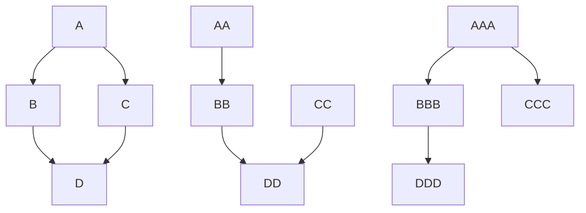

First attempt at having a diagram integrated in github.

Oops it works only in gitlab not github. See https://github.com/github/markup/issues/533 and https://github.community/t/feature-request-support-mermaid-markdown-graph-diagrams-in-md-files/1922/141

Just use a browser extension:

https://github.com/BackMarket/github-mermaid-extension

Direct link for Chrome: https://chrome.google.com/webstore/detail/github-%20-mermaid/goiiopgdnkogdbjmncgedmgpoajilohe

Direct link for Firefox: https://addons.mozilla.org/en-GB/firefox/addon/github-mermaid/

Live mermaid editor: https://mermaid-js.github.io/mermaid-live-editor/edit#eyJjb2RlIjoic2VxdWVuY2VEaWFncmFtXG5BbGljZSAtPiBCb2I6IEF1dGhlbnRpY2F0aW9uIFJlcXVlc3RcbkJvYiAtLT4gQWxpY2U6IEF1dGhlbnRpY2F0aW9uIFJlc3BvbnNlXG5BbGljZSAtPiBCb2I6QW5vdGhlciBhdXRoZW50aWNhdGlvbiBSZXNwb25zZVxuQm9iIC0tPiBBbGljZTogQW5vdGhlciBhdXRoZW50aWNhdGlvbiBSZXNwb25zZSIsIm1lcm1haWQiOiJ7XG4gIFwidGhlbWVcIjogXCJkZWZhdWx0XCJcbn0iLCJ1cGRhdGVFZGl0b3IiOnRydWUsImF1dG9TeW5jIjp0cnVlLCJ1cGRhdGVEaWFncmFtIjp0cnVlfQ

